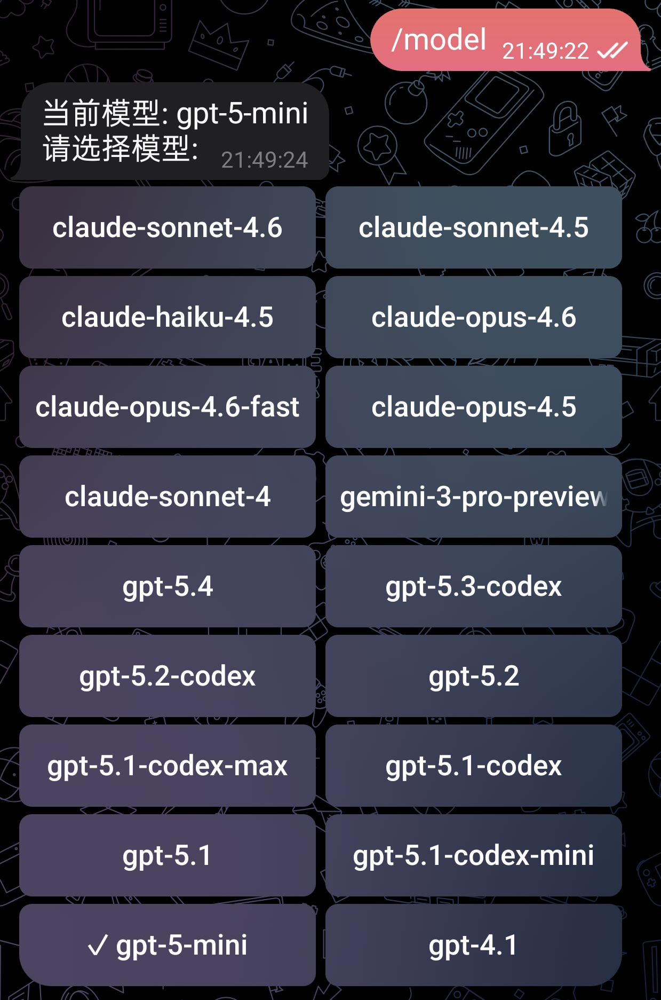
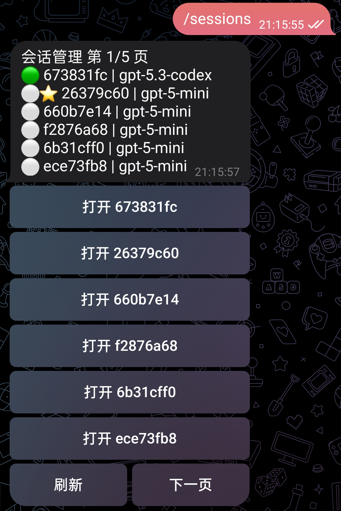
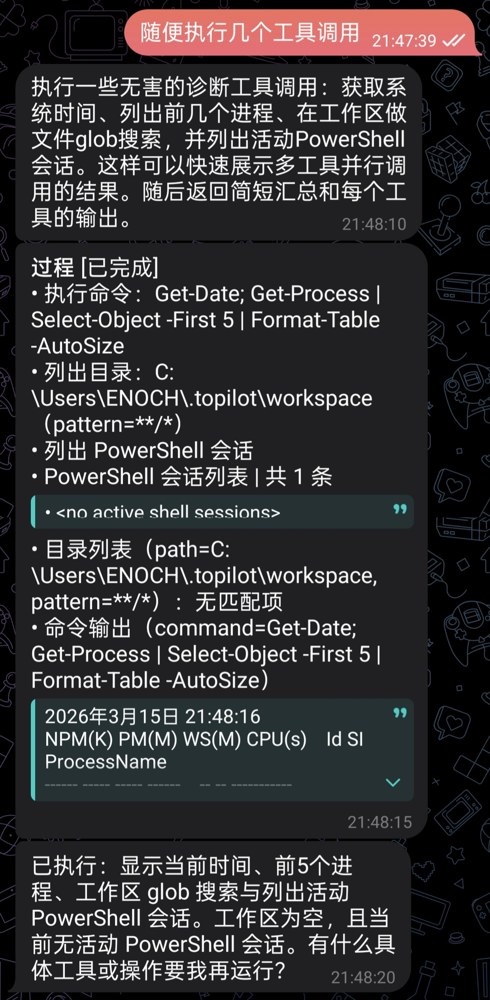

<div align="center">

<h1 align="center">Topilot</h1></div>

简体中文 | [English](./README-en.md)

通过 Telegram Bot 使用 GitHub Copilot CLI

## 运行截图

<div align="center" style=" gap: 20px; flex-wrap: wrap; justify-content: center;">


<br><br><br>

</div>

## 项目背景

Topilot 将本地 GitHub Copilot CLI 桥接到 Telegram Bot，面向个人远程使用场景。

项目重点解决以下问题：

- 在移动端继续使用本机已登录的 Copilot CLI
- 在 Telegram 中查看流式回复与工具执行过程
- 接管本机已有会话并延续上下文

## 功能特性

- Telegram 机器人接入与 Chat ID 白名单控制
- Copilot 会话功能与多会话切换
- 接管本机运行中的会话，并在会话详情页追踪历史刷新
- 流式传输结果
- 工具调用过程等展示

## 环境要求

- Python 3.11+
- 已安装并可执行的 `copilot` CLI
- 已完成 `copilot login`
- 拥有 Telegram Bot Token
- Windows PowerShell 或兼容的 PowerShell 环境

## 安装与启动

克隆项目，然后在项目根目录执行

```powershell
pip install -e .
```

待安装成功后执行 `topilot` 即可运行

首次运行会自动进入交互式配置向导，生成默认配置文件 `~/.topilot/config.json`

也可以手动进行初始化

```powershell
topilot init
topilot doctor
topilot start
```

## 配置说明

可自行修改配置 JSON 文件，固定位置为 `~/.topilot/config.json`

目录结构

```text
~/.topilot/
	config.json
	data/
		chats.json
		sessions.json
	logs/
		app.log
	workspace/
```

常用配置字段

- `telegram.bot_token`：Telegram 机器人令牌（必填）
- `telegram.allowed_chat_ids`：允许访问的 Telegram Chat ID，可使用数组或逗号分隔字符串。留空代表允许所有 Chat ID 访问，强烈建议配置以保证安全
- `telegram.proxy_url`：如需使用代理访问 Telegram API，需要设置代理 URL，例如 `http://127.0.0.1:10808`
- `copilot.cli_command`：运行 Copilot CLI 所需的命令，默认 `copilot`
- `copilot.model`：Copilot CLI 默认使用的模型，默认为 `gpt-5-mini`
- `copilot.available_models`：模型实时发现失败时使用的回退候选列表
- `copilot.timeout_seconds`：单次调用超时秒数，默认为 3600
- `copilot.allow_all_tools`：调用 Copilot CLI 时是否附带 `--allow-all-tools`
- `copilot.add_workspace_dir`：调用 Copilot CLI 时是否自动附带 `--add-dir`
- `copilot.reasoning_effort`：传递给 Copilot CLI 的推理强度，可为空
- `copilot.forward_reasoning`：是否在非流式路径转发思考文本
- `runtime.workspace_root`：默认工作区路径
- `runtime.session_watch_interval_seconds`：会话追踪轮询间隔，运行时按 `1` 至 `15` 秒范围生效
- `logging.log_level`：文件日志级别
- `logging.console_log_level`：控制台日志级别
- `logging.httpx_log_level`：`httpx` 日志级别，建议 WARNING，避免轮询请求刷屏

## Bot 可用命令

- `/whoami`：查看当前 chat/user 信息
- `/session_current`：查看当前会话 ID 与简要摘要
- `/sessions`：会话管理入口（列表/接管/历史/删除）
- `/session_new [title]`：新建并切换到会话
- `/session_use <session_id前缀>`：按唯一前缀切换已保存会话，或接管本机发现的唯一匹配会话；前缀不唯一时会拒绝切换
- `/model`：查看/切换当前模型
- `/status`：查看后端状态、当前会话、来源、状态、模型和工作区摘要，并可通过按钮打开后端诊断报告
- 直接发送文本将进入对话

Bot 启动时会自动向 Telegram 注册命令菜单；`/start`、`/help`、`/status`、`/model`、`/sessions`、`/session_current` 等入口也提供内联按钮，常用操作可直接点击完成。

## 当前版本范围

当前版本已实现：

- 配置初始化、覆盖备份、启动前 `doctor` 诊断
- Telegram 命令、按钮回调、Chat ID 白名单和 `/whoami` 诊断
- Copilot CLI 文本对话、JSON 流式回复和工具过程摘要
- 多会话创建、切换、删除、本机 `session-state` 发现与接管
- 通过会话详情页对运行中会话进行轮询追踪
- 模型发现、回退候选、按钮切换和按 Chat 持久化
- 基础 pytest 自动化测试套件

不在当前版本范围内的能力包括图片/语音/文件输入、浏览器自动化、插件市场、企业级权限、多实例部署和数据库持久化。

## 测试

安装开发依赖后执行：

```powershell
pip install -e ".[dev]"
pytest
```

自动化测试覆盖配置、存储、会话扫描、Copilot 事件解析、异常提示、Telegram 白名单、命令注册、模型菜单和会话回调渲染逻辑。
截至 2026-06-03，项目已完成真实 Telegram 外网联调与真实 Copilot CLI 集成联调，核心交互链路运行正常。

## License

MIT License，详见 [LICENSE](./LICENSE)

## 免责声明
本项目定位为个人自托管工具，适用于个人可信环境。使用者需自行保护 Telegram Bot Token、Copilot 登录状态、本地工作区和访问白名单。项目不提供企业级隔离、审计或安全担保，因使用本项目产生的风险与后果由使用者自行承担。
